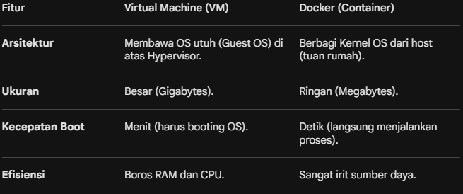

## Introduction to Docker and Containerization

tanpa standarisasi, source code yang jalam sepurna di deveper local enviroment frequently crash in production server enviroment.

- Docker Bukan sperti vm (virtual machine), tetapi docker berjalan di atas host os (operating system).
- Docker menggunakan kernel os yang sama dengan host os.
- Docker juga open-source yang sering dibicarakan dengan istilah contanierization.

1. Apa itu Kontainerisasi?
    Bayangkan kamu ingin mengirim barang. Dulu, barang dikemas sembarangan sehingga sering rusak saat pindah dari truk ke kapal. Lalu, terciptalah Kontainer Fisik yang standarnya sama di seluruh dunia. Apa pun isinya, kontainer tersebut pasti muat di kapal, truk, atau kereta mana pun.

    Dalam software, Kontainerisasi adalah teknologi yang membungkus aplikasi bersama dengan semua "perpustakaan" (library), konfigurasi, dan dependensi yang dibutuhkannya agar bisa berjalan.

    Prinsip Utama: "Build Once, Run Anywhere." Aplikasi yang berjalan di laptopmu pasti akan berjalan sama persis di server produksi tanpa error "tapi di laptop saya jalan".

2. Docker vs. Virtual Machine (VM)
    Banyak yang bingung membedakan keduanya. Perbedaan utamanya terletak pada efisiensi sumber daya:
    

3. Komponen Utama Docker
    Untuk menguasai Docker, kamu perlu memahami 4 istilah ini:

    1. Dockerfile: "Resep" atau file teks berisi instruksi cara membuat aplikasi kamu (misal: gunakan Ubuntu, instal Python, lalu jalankan script A).

    2. Image: Hasil "masakan" dari Dockerfile. Image bersifat read-only dan menjadi template untuk menjalankan kontainer.

    3. Container: Instance yang sedang berjalan dari sebuah Image. Kamu bisa menjalankan banyak kontainer dari satu Image yang sama.

    4. Docker Hub/Registry: "Gudang" tempat orang berbagi Image. Mirip seperti GitHub, tapi untuk Docker Image.

4. Alur Kerja (Workflow) Docker
Alurnya cukup sederhana:

    Step 1 (Build): Kamu membuat Dockerfile lalu mengubahnya menjadi Image.

    Step 2 (Push): Kamu simpan Image tersebut ke Docker Hub agar bisa diakses tim lain.

    Step 3 (Pull & Run): Server tujuan mengambil Image tersebut dan menjalankannya sebagai Container.

5. Mengapa Docker Penting di Tahun 2026?
    1. Di tahun 2026 ini, Docker bukan lagi sekadar tren, melainkan kebutuhan wajib karena:

    2. Microservices: Memungkinkan aplikasi besar dipecah menjadi layanan-layanan kecil yang independen.

    3. CI/CD: Mempercepat proses testing dan deployment secara otomatis.

    4. Cloud-Native: Semua penyedia cloud (AWS, Google Cloud, Azure) sudah terintegrasi penuh dengan Docker.

    5. WASM (WebAssembly): Integrasi terbaru yang memungkinkan kontainer berjalan lebih cepat lagi di berbagai arsitektur hardware.

Penjelasan Infografis:

Atas: Metafora fisik yang membandingkan Pengiriman Tradisional yang berantakan dengan ketergantungan tinggi, melawan Kontainerisasi yang rapi, modular, dan efisien.

Tengah Kiri: Diagram perbandingan arsitektur antara Virtual Machine (VM) yang berat dan memboroskan sumber daya (menit untuk boot, gigabytes), melawan Docker (Container) yang ringan dan efisien (detik untuk boot, megabytes), berkat berbagi Kernel OS.

Tengah Kanan: Penjelasan 4 Komponen Utama Docker:

Dockerfile (Resep) -> di-build menjadi -> Image (Template).

Image (Template) -> dijalankan menjadi -> Container (Aplikasi Aktif).

Image dapat disimpan/diambil dari Docker Hub (Gudang).

Bawah: Visualisasi Alur Kerja Docker (Build, Push, Pull & Run), yang menjamin aplikasi berjalan sama persis di Laptop, Server Produksi, maupun Cloud.