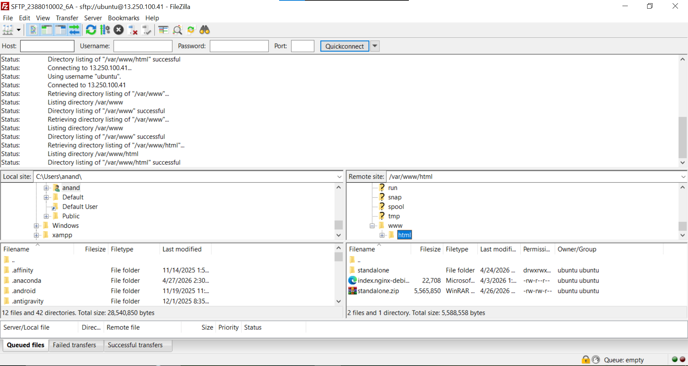
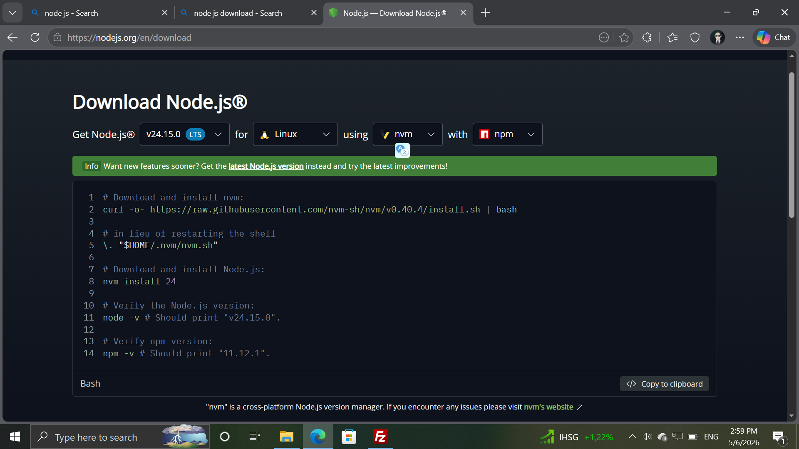
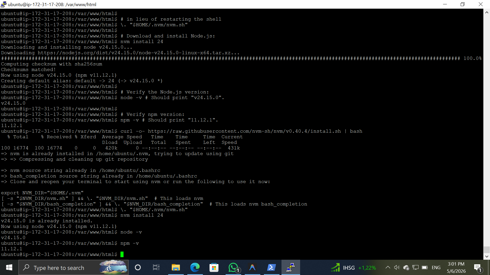
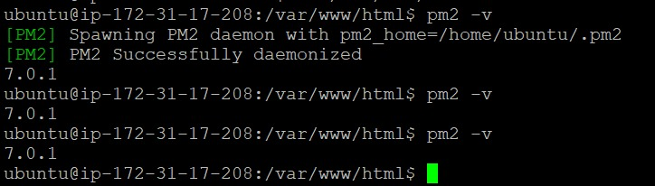
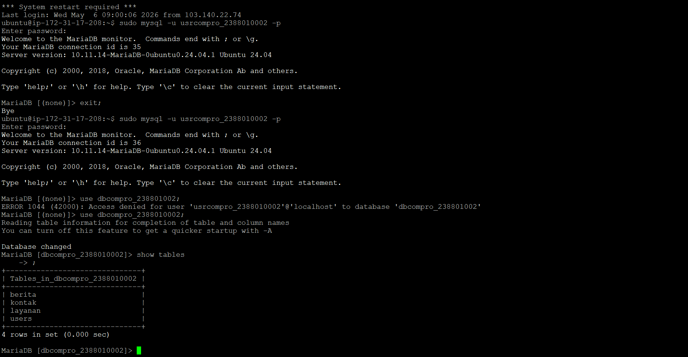
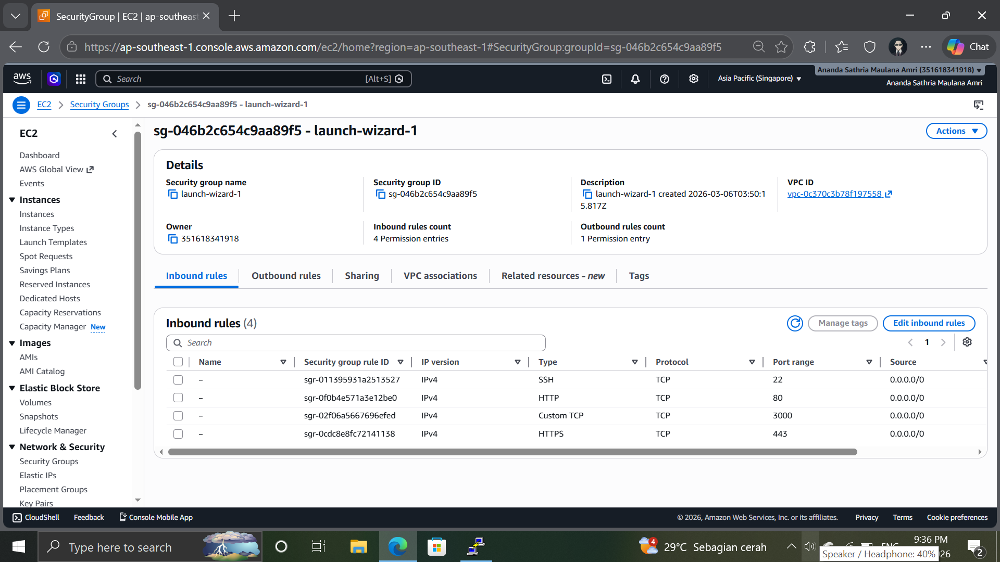
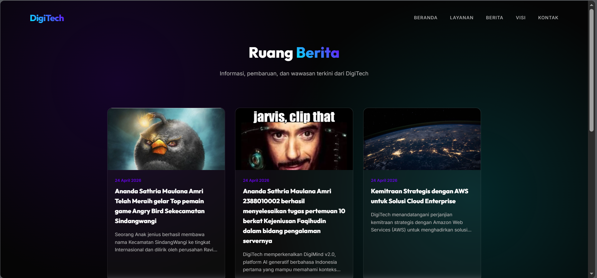

# Migration Standalone folder to instance AWS EC2

1. Upload standalone.zip via STFP (filezilla yang sudah dilakukan di Pertemuan-9)
2. konek open SSH -> -i <lokasi-key-aws> ubuntu@<ip-address>
3. Install tools untuk unzip -> sudo apt install unzip
4. cd /var/www/html
5. extract standalone.zip -> unzip standalone.zip
6. cek hasil extract -> ls -R atau cek langsung di filezilla
    
    
7. install intreperer untuk apps base node js sesuai dokumentasi resmi. untuk node js -> https://nodejs.org/en/download 
ubah ke get node js seperti pada gambar dibawah ini
    

    - Verify the Node.js version:
    node -v
    - Verify npm version:
    npm -v
    

   - Install PM2 untuk session state -> npm intall pm2@latest -g
   - pm2 -v
   

8. Export - Import DB 
    - Start DBMS (Laragon, xampp, dll)
    - Export db_compro
    - hapus ENGINE=InnoDB DEFAULT CHARSET=utf8mb4 COLLATE=utf8mb4_0900_ai_ci
    - Login usercompro
    - use dbcompro_NIM;
    - Copy Paste Query ctrl+A file sql export -> Klik Kanan di terminal AWS
    -show tables;
    

9. kita sesuaikan file .env
- cd standalone
- sudo nano .env
- sesuiakn isi .env : 
  DB_HOST=[IP_ADDRESS]
  DB_USER=usercompro_NIM
  DB_PASS=[PASSWORD]
  DB_NAME=dbcompro_NIM
 - ctrl+x -> y -> Enter 

10. pm2 start server.js

11. tambah / buka port 3000 di AWS Security Groups

12. Akses http://[IP_ADDRESS]:3000
13. akses BE http://[IP_ADDRESS]:3000/admin edit berita ke 2 tambahkan nama - nim
