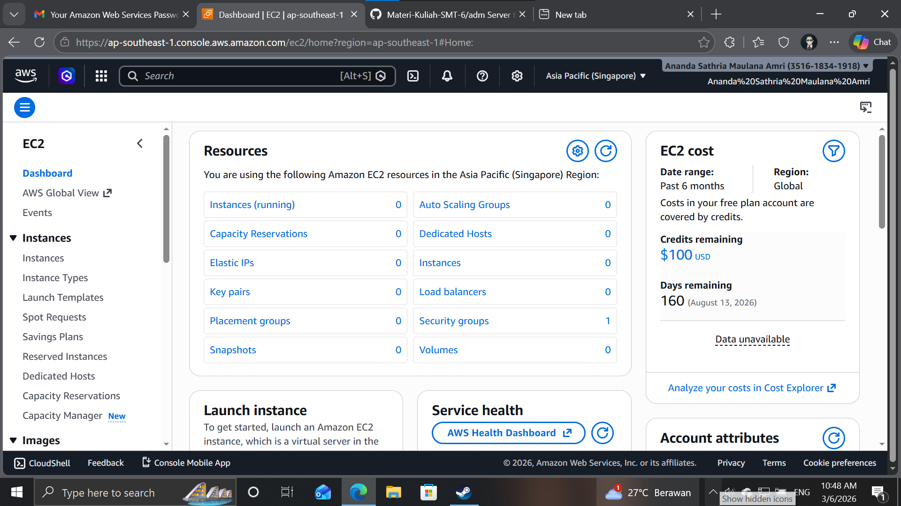
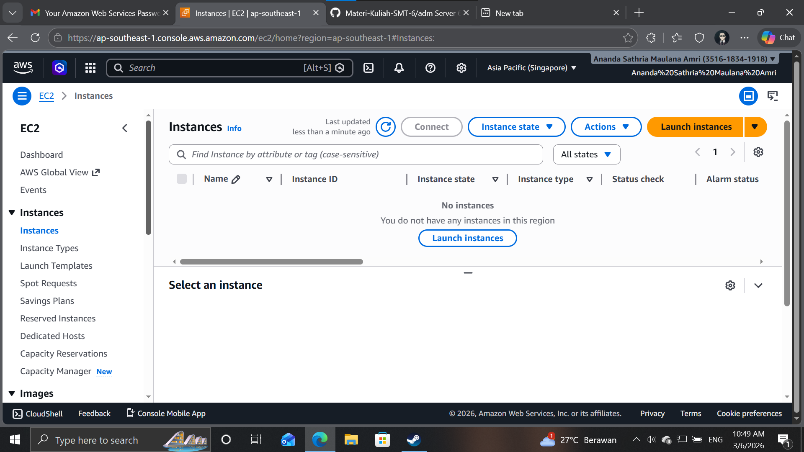
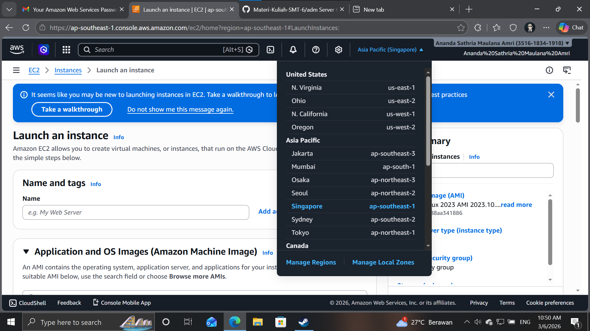
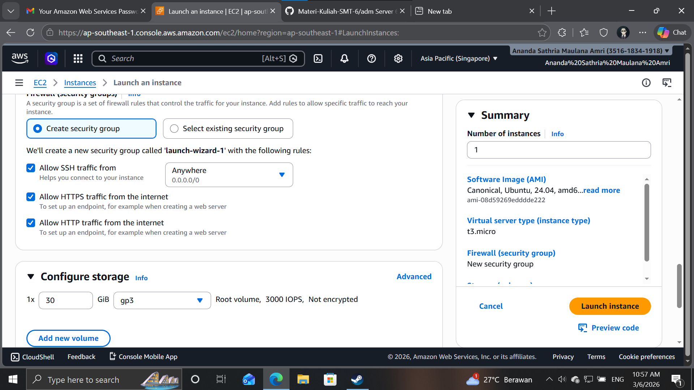
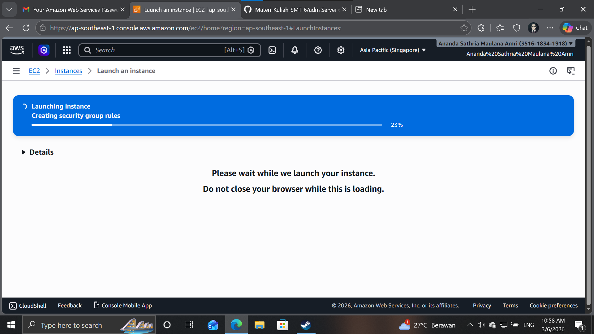
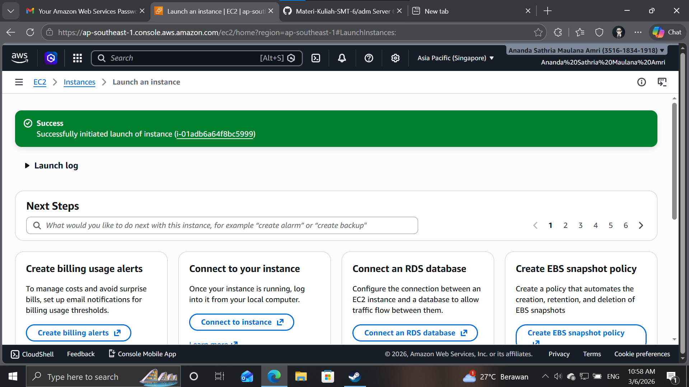
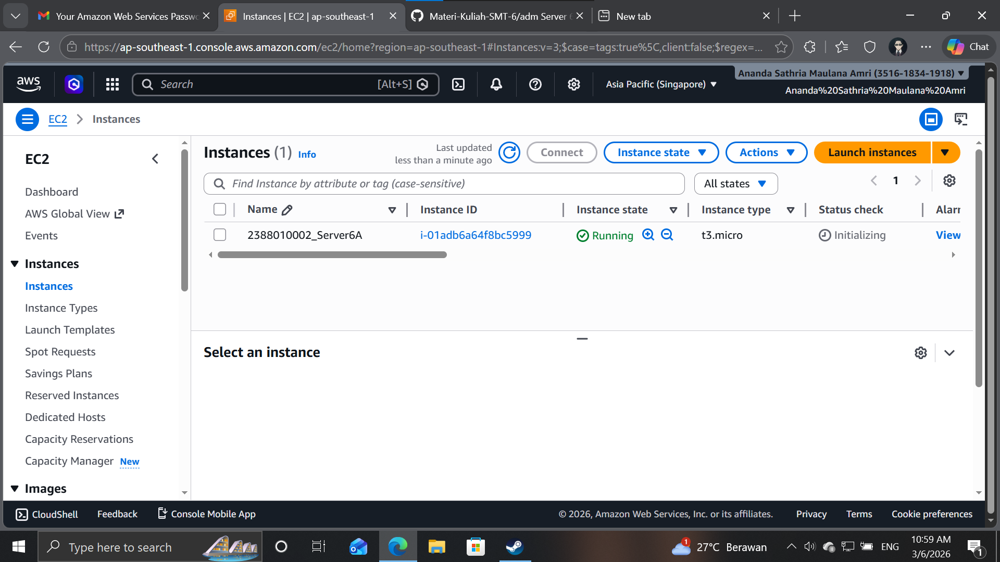

Membuat VM / Instance di AWS EC2 dgn AMI

1. Buka Menu EC2 dari Dashboard]

2. klik menu launch instance

3. Pastikan Region terdekat

4. buat nama instance dengan NIM_Server6A
5. OS pilih UBUntu
6. pilih T3.Micro
7. Membuat Key Pair -> create new key pair -> isi nama-> file .pem -> create

8. Network Securty
    - Allow SSH traffic
    - Allow HTTP traffic
    - Allow HTTPS traffic
9. storage setting 30GB

10. klik launch instance

11. Pastikan Alert Success

12. Pastikan Nama Sesuai -> Klik Instance
