# Membuat biling Allert di AWS untuk menghindari alokasi dana

1. Menu Dashboard AWS kita piling Billing Preference
- Masuk all service Billing and cost management

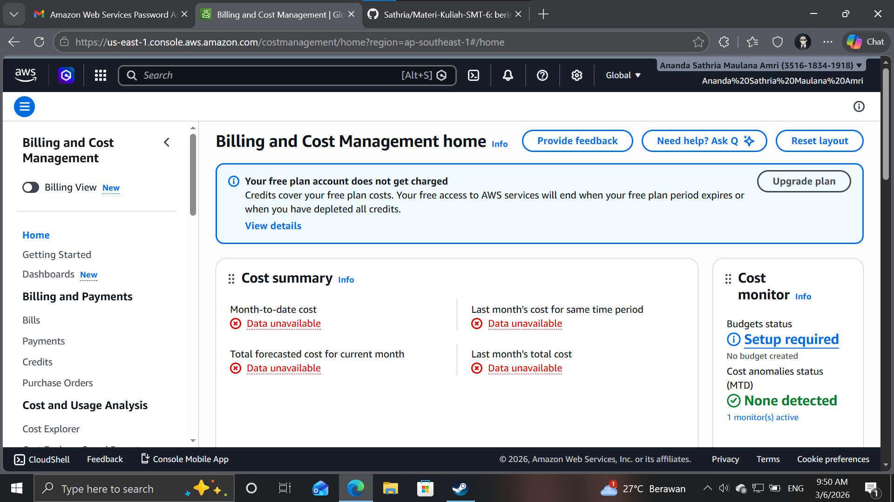

- Pilih menu Alert Preference
- Pilih menu Alert Preference klik edit
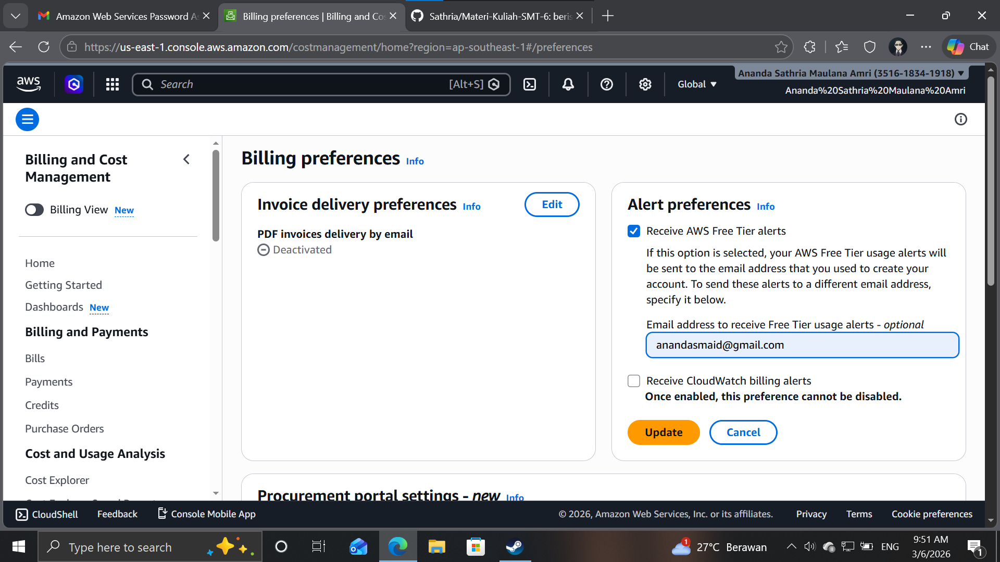

- isi Email ceklis Receive
- Klik Update
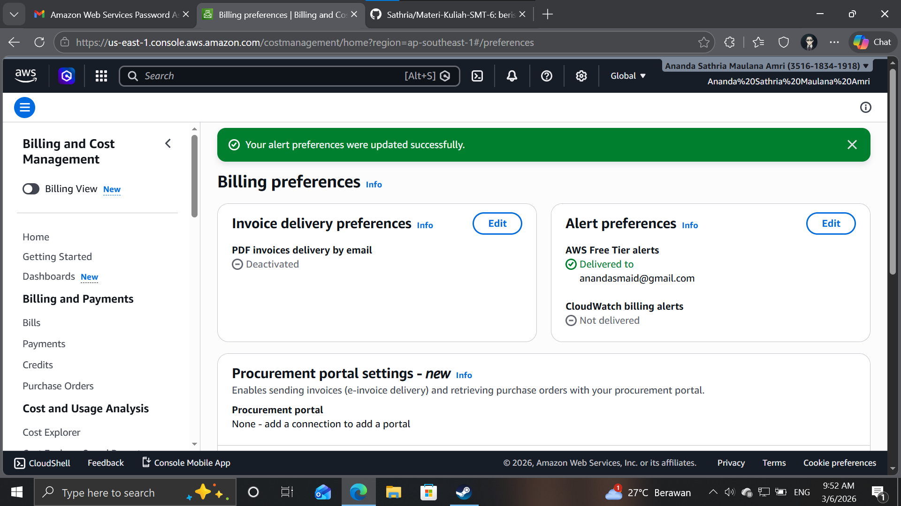

2. Masuk Menu Cloudwatch
- pilih all service lalu cari Cloudwatch

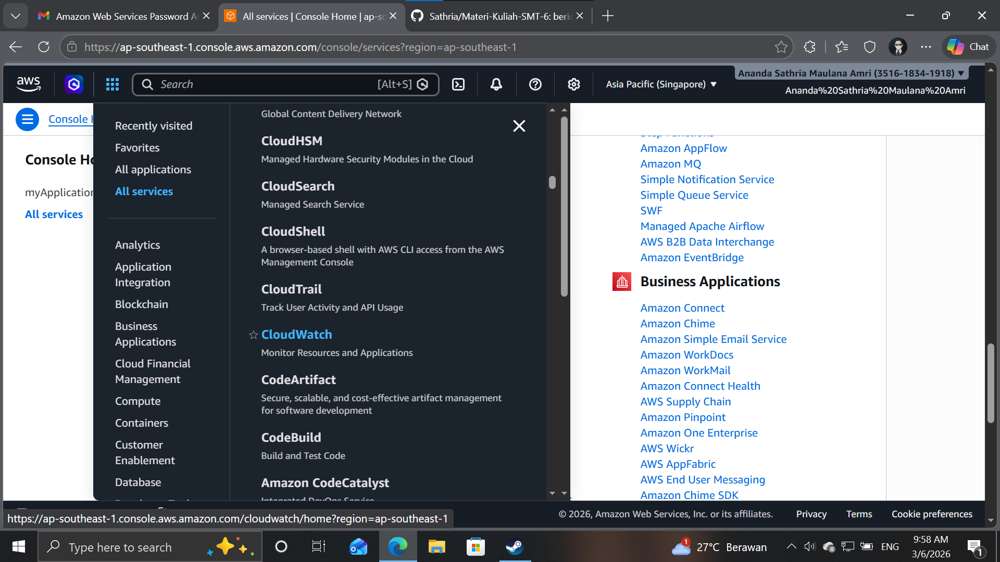

3. pilih create alarm
- Pastikan server lokasi di N. Virginia
- pilih menu Create Alert
- Klik Metric
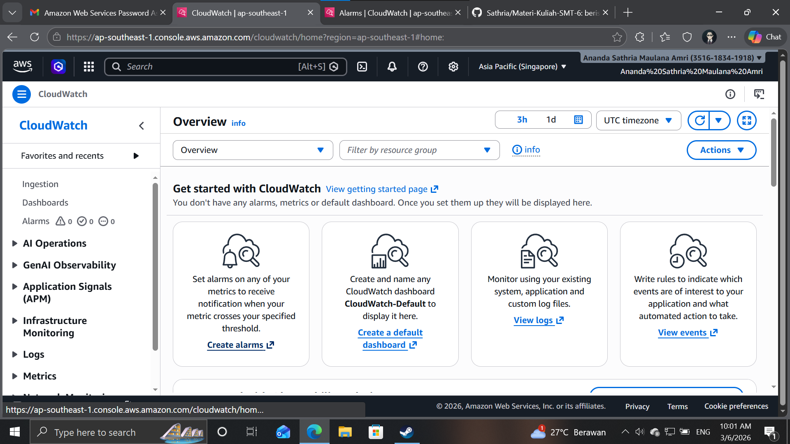
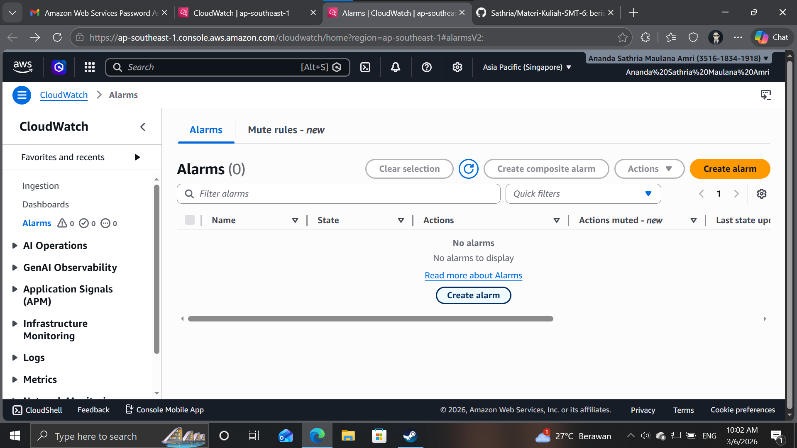
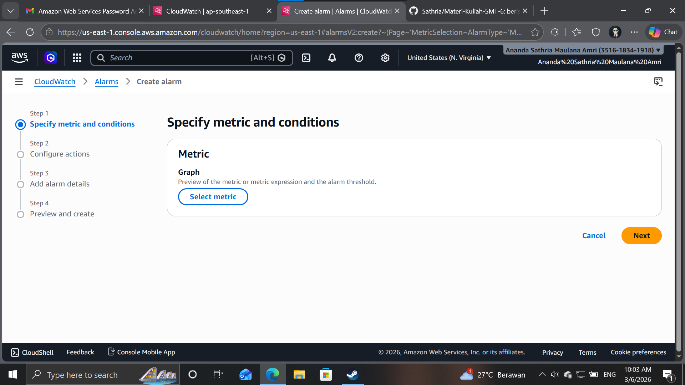
- pilih biling
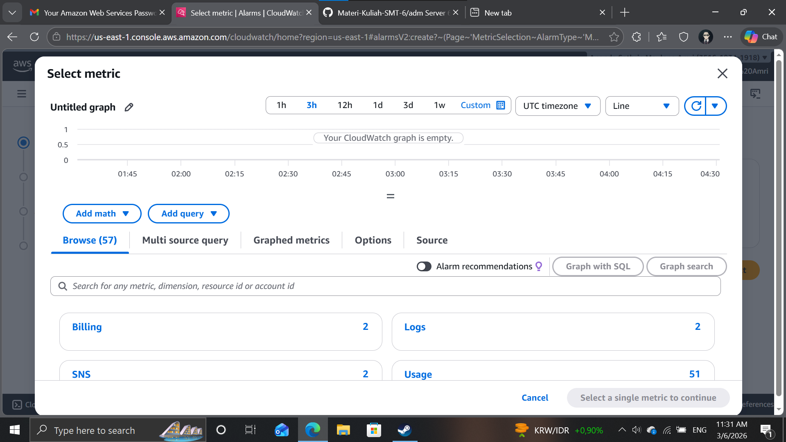
- pilih estimate charge
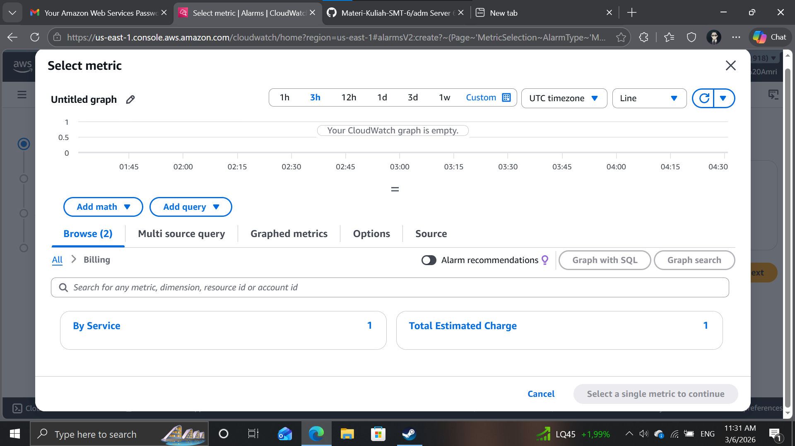
- pilih / ceklis mata uang USD
- Klik Select Metric
- Beri Nama Alert = NIM_BillingAlert
- Condititon Static >  Greathertha > 1 USD
- Create New Topic => NIM_BillingAlert -> Create
- Select an Existing SNS topic -> NIM_BillingAlert
- Klik Next
- Nama Alarm BillingAlert
- Emailnya Default saja lalu next
- Buka email dari aws lalu confirm
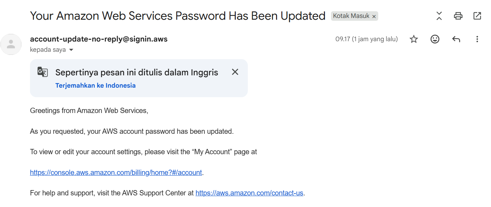
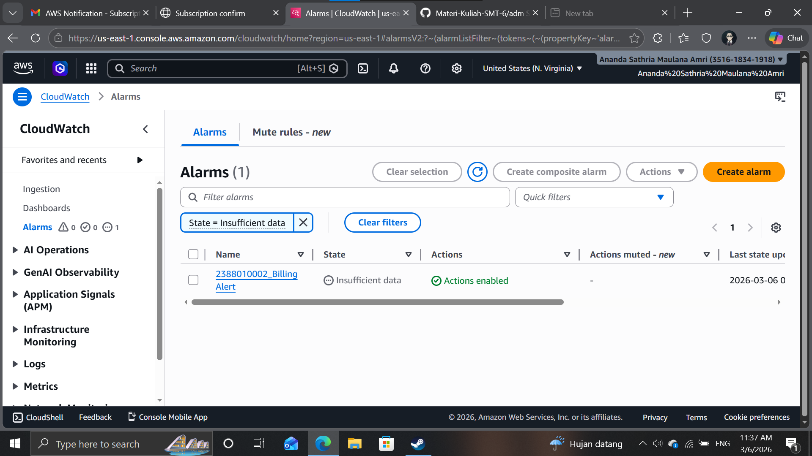

