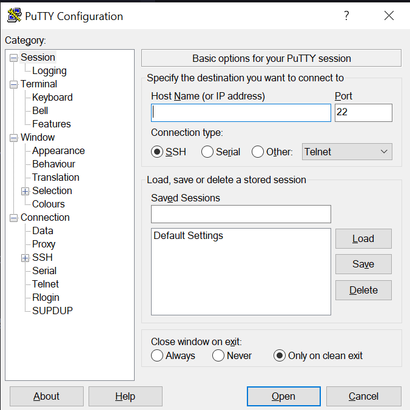
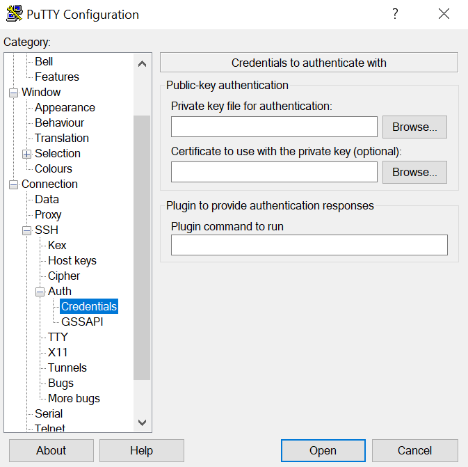
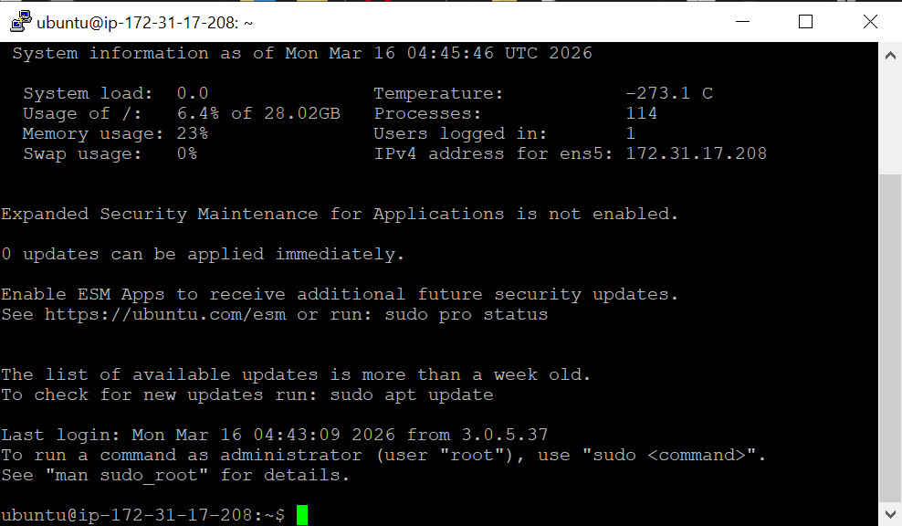
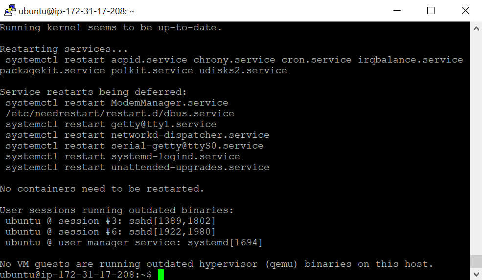
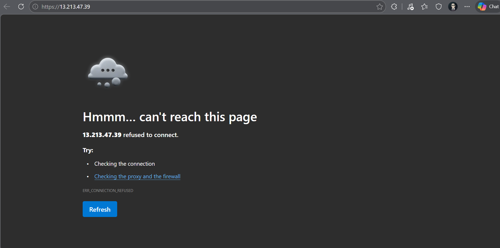
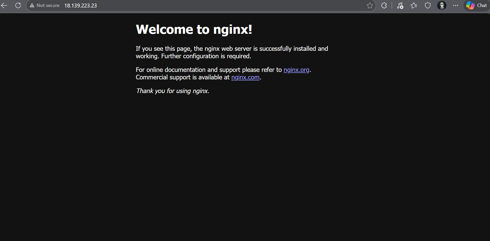
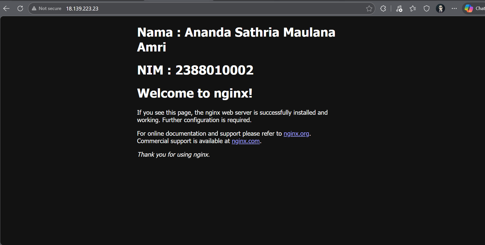

# Remote SSH dari AWS EC 2 Server

1. Unduh dan isntall Putty di https://www.chiark.greenend.org.uk/~sgtatham/putty/latest.html

    

    

2. Konversi eksistensi private key
    - Buka putty Gen
    - Load Private Key.pem (file .pem didapat saat membuat instance ec2 yang ada di folder pertemuan 2 yang biasanya di folder download)
    
    
    - Save private key menjadi ekstensi .ppk

    

3. Setting up remote SSH dengan Putty
    - isi ipv4 addres public data berasal dari instance masing2

    

    -port SSh (22)
    -Load Private key.ppk dimenu connection-> SSh-> Auth-> Credential

    

    - User dari instance masing-masing (ubuntu)

    

4. Setiap awal Remote kita lakukan Patchinhg OS
    - sudo apt-get update && sudo apt-get upgrade
    
    

5. Coba lakukan instalasi Web Server
dalam keadaan kosong

Install salah satu web server 
- sudo apt install nginx
lalu masukan ipv4 publicnya di browser dengan http bukan https

- Tambahan jika ingin mengedit tampilan Welcome to nginx
- ketik di terminal ubuntu sudo nano /var/www/html/index.nginx-debian.html
- edit sesuai keinginan
- save dan exit dengan mengetik ctrl + o lalu enter
- untuk menghentikan nano ketik ctrl + x
