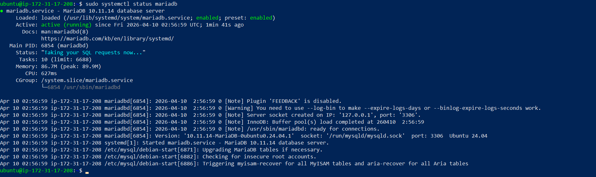
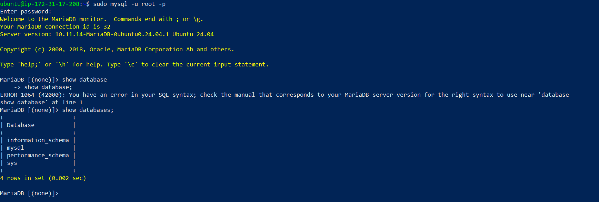
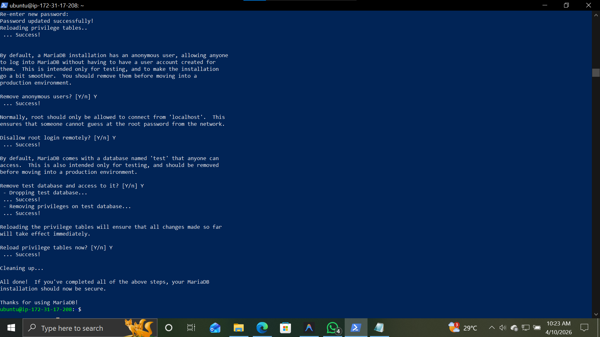
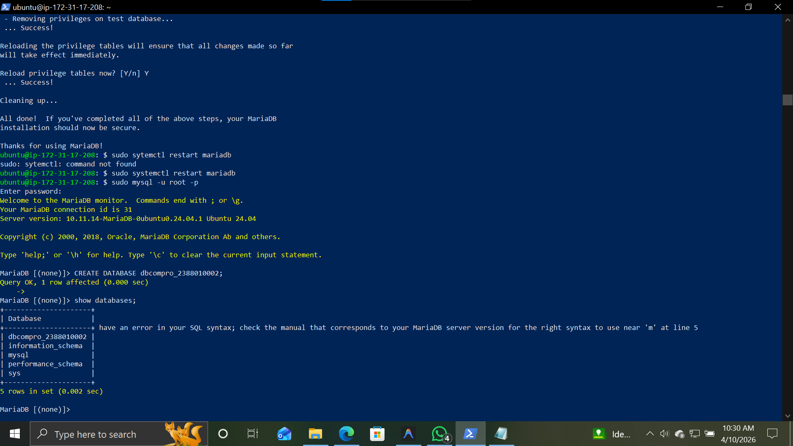
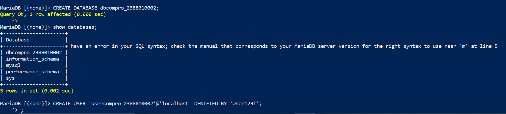
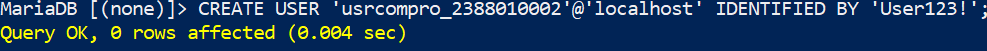
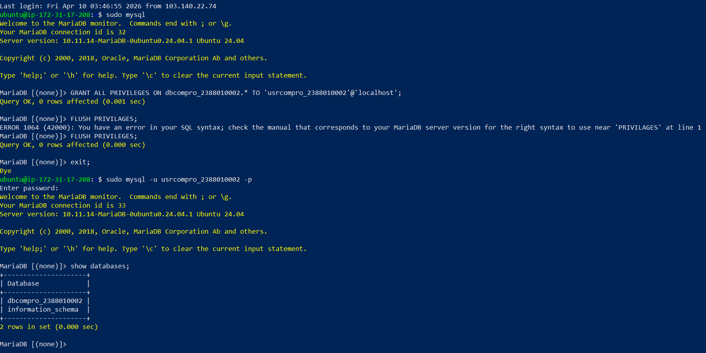

# Setting Up Database di AWS Ec2 menggunakan Maria DB

1. aktifkan instace aws ec2
2. Remote instace menggunakan ssh Powershell dengan format : ssh -i <path-to-key.pem> <user>@<public-ip>
3. update dan upgrade sistem
    ```bash
    sudo apt update && sudo apt upgrade -y
    ```
4. install mariadb
    ```bash
    sudo apt install mariadb-server -y
    ```
5. Cek status mariadb
    ```bash
    sudo systemctl status mariadb
    ```


6. test default database di mariadb
    ```bash
    sudo mysql -u root -p
    ```
    lalu cek database default
    ```bash
    show databases;
    ```


7. Hardening Database Server sudo mysql_secure_installation
    - Change the password for the root user = Y
    - Remove anonymous users = Y
    - Disallow root login remotely = Y
    - Remove test database and access to it = Y
    - Reload privilege tables = Y



8. Create DB untuk Website Company Profile
 - Login sebagai root
 - Create DB nama dbcompro_NIM => CREATE DATABASE dbcompro_NIM;



 - Create User dengan nama = usrcompro_NIM dan password = [PASSWORD] => CREATE USER 'usrcompro_NIM'@'localhost' IDENTIFIED BY '[PASSWORD]';




  - Grant user akses ke DB yang baru dibuat => GRANT ALL PRIVILEGES ON dbcompro_NIM.* TO 'usrcompro_NIM'@'localhost';
  - Flush privileges => FLUSH PRIVILEGES;
  - exit;
  - login sebagai usrcompro_NIM dan cek apakah bisa akses ke DB yang baru dibuat
