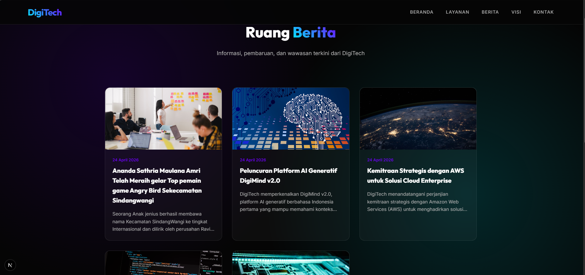
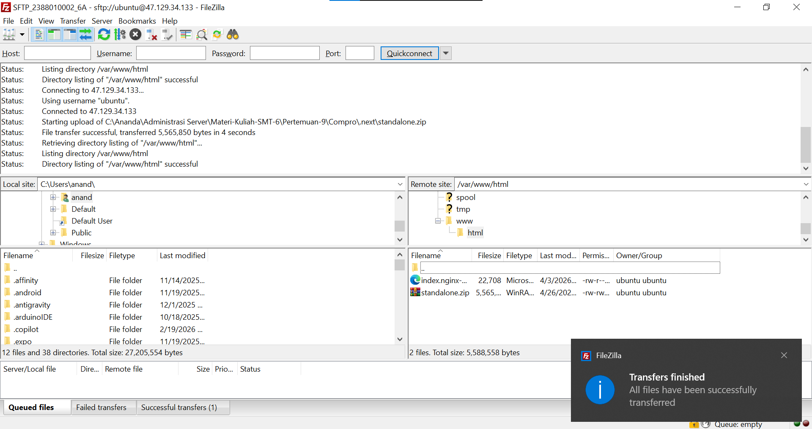

# Deploy Web Apps Framework Next.js ke aws

1.Pastikan Web apps berjalan di local
- install dependesi 'npm installl'
- create db
- Jalankan web apps 'npm run dev'
- akses web apps di browser 'http://localhost:3000' 
-Testing Front Pastikan tampilan muncul dan tanpa error
- Testing Back End http://localhost:3000/admin
    username: admin
    passwor: admin123

-Create static File -> npm run build
-Archive folder Standalone -> zip
2.Proses Deploy File ke AWS EC2 
- nyalakan instance AWS
- Connect via Terminal
- Connet Filezilla
- lalu paste file zip bersamaan dengan file html    
