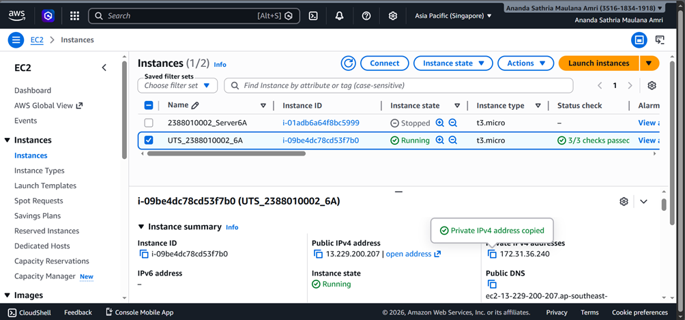
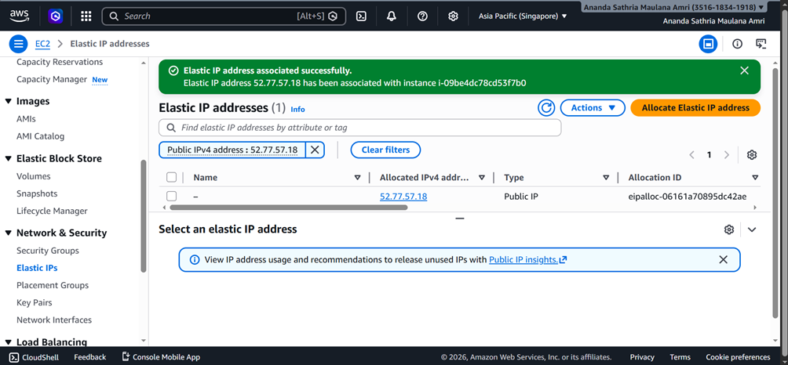
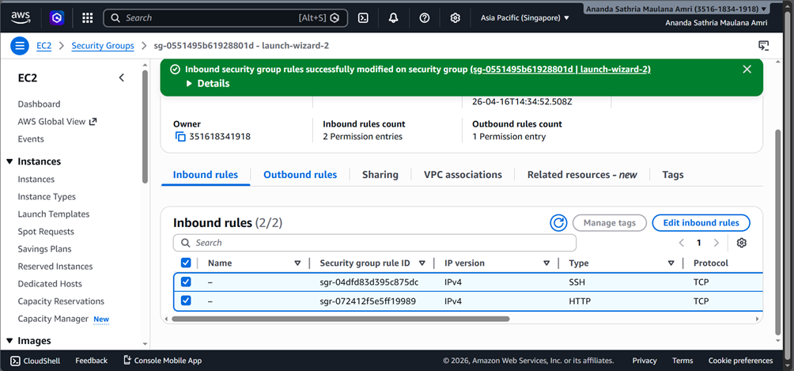
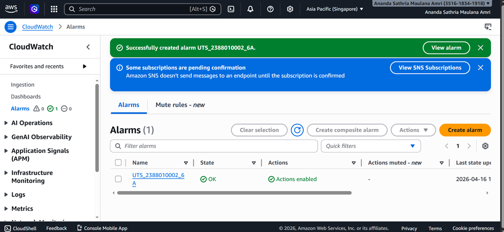
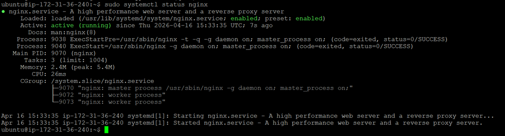
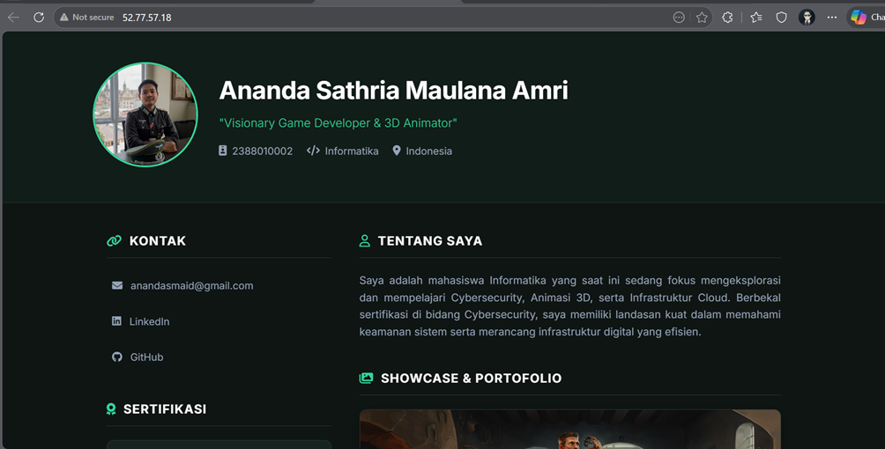

Laporan UTS
Deploy Curriculum Vitae (CV) atau Portofolio Pribadi Anda dalam bentuk Website Statis ke 
server AWS dari nol
Nama	: Ananda Sathria Maulana Amri
NIM	: 2388010002
Kelas	: Informatika 6A

1.	Tahap Provisioning & Security Saya membuat instance EC2 di region Singapore (ap-southeast-1) menggunakan tipe t3.micro dan OS Ubuntu 24.04 LTS. Saya juga telah mengalokasikan dan menghubungkan Elastic IP 52.220.149.201 ke instance ini agar alamatnya tidak berubah.

•	Screenshot halaman utama AWS EC2 Console (menunjukkan Instance ID, status Running, dan Elastic IP).
 
 
•	Screenshot halaman Security Group Inbound Rules (menunjukkan Port 22 hanya diakses oleh My IP).

•	Screenshot halaman CloudWatch Alarms (menunjukkan alarm CPU berstatus OK atau hijau).
 
•	Screenshot Terminal/PuTTY saat Anda berhasil mengeksekusi perintah sudo systemctl status nginx.

 

Hasil dari pembuatan website CV
 

